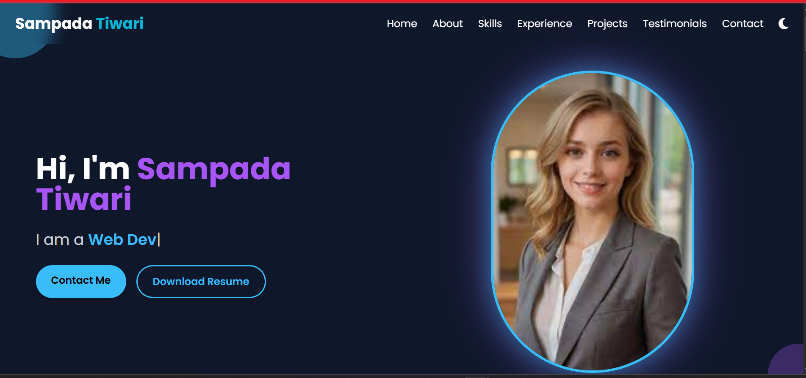
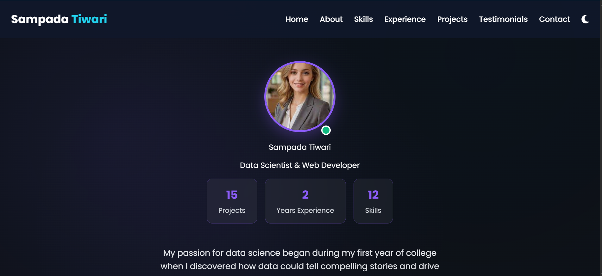
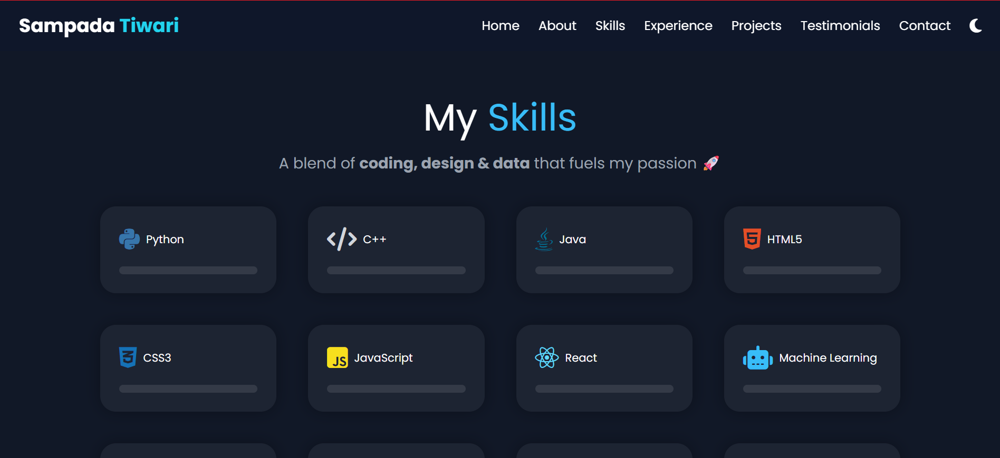
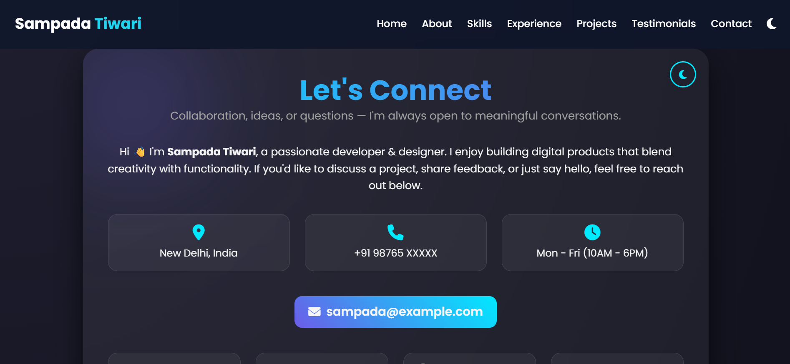

<h1 align="center"> Code_Creations </h1>


<a href="https://github.com/sampadatiwari30/Code_Creations/blob/main/LICENSE"></a>

<a href="https://github.com/sampadatiwari30/Code_Creations"></a>


<h2>📖 Table of Contents</h2>

- <a href="#overview"> Overview </a>
- <a href="#project-insights"> Project Insights </a>
- <a href="#screenshots">Screenshots</a>
- <a href="#project-structure">Project Structure</a>
- <a href="#contribution-guidelines">Contribution Guidelines</a>
- <a href="#acknowledgments">Acknowledgments</a>
- <a href="#submitting-pull-request">Submitting a Pull Request</a>
- <a href="#contact">Contact</a>
- <a href="#how-to-contribute">How to Contribute</a>
- <a href="#contributing">Contributing</a>
- <a href="#code-of-conduct">Code of Conduct</a>
- <a href="#contribution">Contribution </a>
- <a href="#suggestions-feedback"> Suggestions & Feedback</a>
- <a href="#show-your-support">Show Your Support</a>
- <a href="#license">License</a>
- <a href="#stargazers">Stargazers</a>
- <a href="#forkers">Forkers</a>
- <a href="#project-admin">Project Admin</a>


<h2 id="overview">🔍 Overview</h2>

> This website serves as an interactive and dynamic portfolio that showcases a collection of front-end web development projects. It features a modern, minimalist design with a responsive grid layout, where each card represents a unique interactive application built using core **Web technologies — HTML, CSS, and JavaScript**.

>Every project demonstrates practical expertise in UI/UX design, animation, and responsive interactivity, reflecting a strong command over creating engaging digital experiences. Visitors can interact directly with each project from the main page, making the portfolio not only a display of work but also a hands-on showcase of creativity, functionality, and technical proficiency.


<div align="center">
  
</div>


<h2 id="project-insights">📊 Project Insights</h2>

<table align="center">
    <thead align="center">
        <tr>
            <td><b>🌟 Stars</b></td>
            <td><b>🍴 Forks</b></td>
            <td><b>🐛 Issues</b></td>
            <td><b>🔔 Open PRs</b></td>
            <td><b>🔕 Closed PRs</b></td>
            <td><b>🛠️ Languages</b></td>
            <td><b>👥 Contributors</b></td>
        </tr>
     </thead>
    <tbody>
         <tr>
            <td></td>
            <td></td>
            <td></td>
            <td></td>
            <td></td>
            <td></td>
            <td></td>
        </tr>
    </tbody>
</table>


<h2 id="demo">🚀 Live Demo</h2>

Experience kala.ficial live here:
<br>
👉 [](https://sampadatiwari30.github.io/Code_Creations/)


<h2 id="screenshots">📸 Screenshots</h2>

<!-- Using HTML for consistent width -->








## 🚀 Exciting News...

We’re thrilled to announce that **_Code_Creations_** is now an official project under **GirlScript Summer of Code – GSSoC'25!** 💃🎉💻  
This milestone marks the beginning of an incredible journey of collaboration, innovation, and open-source learning. 🌟  

👩‍💻 **GSSoC** (GirlScript Summer of Code) is one of India’s **largest 3-month-long open-source programs**, empowering developers across all levels to contribute to meaningful projects 🌍 while gaining real-world experience, mentorship, and community support. 🌱  

🌈 Through this program, contributors will get the opportunity to:  

- ✨ Sharpen their technical and collaborative skills  
- 🤝 Work on impactful, real-world open-source projects  
- 🏆 Gain recognition for their contributions  
- 📜 Earn certificates, badges, and exclusive swag!  

💡 Whether you’re a beginner or an experienced coder, this is your chance to grow, learn, and contribute to the thriving open-source community.  

 🎉 We can’t wait to welcome new contributors from **GSSoC 2025** into the _Code_Creations_ family! 
**Let’s build, learn, and grow together — one commit at a time. 🔥👨‍💻👩‍💻**


<h2 id="project-structure">📁 Project Structure</h2>

```bash
Code_Creations/
│
├── CODE_OF_CONDUCT.md
├── CONTRIBUTING.md
├── LICENSE
├── images /
├── css /
├── js /
├── about.html
├── skills.html
├── offline.html
├── contact.html
├── achivement.html
├── expierence.html
├── project.html
├── index.html
├── manifest.json
├── sw.js
├── README.md
```


<h2 id="contribution-guidelines">📑 Contribution Guidelines</h2>

<p>We welcome contributions of all kinds! Follow these steps to get started:</p>

<ol>
  <li>⭐ <strong>Star the Repository</strong> to show your support.</li>
  <li>🍴 <strong>Fork the Repository</strong> and create a new branch for your updates or bug fixes.</li>
  <li>💻 <strong>Make your changes</strong> in your branch — fix bugs, improve UI/UX, add features, or update documentation.</li>
  <li>📸 <strong>Add Screenshots or demo links</strong> if your changes affect the UI or functionality.</li>
  <li>📝 <strong>Commit your changes</strong> with a meaningful commit message describing your updates.</li>
  <li>📬 <strong>Create a Pull Request</strong> to the main repository. Your PR will be reviewed and suggestions may be added for improvement.</li>
</ol>

<p>By following these guidelines, you help maintain a clean and collaborative workflow for the project. Thank you for contributing! 💜</p>


<h2 id="contributing">🎉 Contributing is Fun!</h2>

<p>We welcome all kinds of contributions — whether it's a new feature, UI/UX improvement, bug fix, or documentation update. Your voice matters! 💜</p>

<p>Your insights and suggestions are invaluable to us. Feel free to reach out to the team for any questions, feedback, or collaboration opportunities.</p>


<h2 id="acknowledgments">🙏 Acknowledgments</h2>

<ul>
  <li>Thank you to all the contributors who have made this project better.</li>
  <li>Special shoutout to <strong>GirlScript Summer of Code (GSSoC’25)</strong> for their amazing mentorship, community support, and resources.</li>
  <li>Built with dedication, collaboration, and lots of chai ☕</li>
</ul>


<h2 id="submitting-pull-request">📥 Submitting a Pull Request</h2>

<p>Follow these simple steps to contribute your changes to <strong>Code_Creations</strong>:</p>

<ol>
  <li>⭐ Star the repository to show your support.</li>
  <li>🍴 Fork the repository and create a new branch for your updates.</li>
  <li>💻 Make your changes — fix bugs, add features, or improve the UI/UX.</li>
  <li>📸 Add screenshots or demo links if your changes affect the user interface.</li>
  <li>📝 Commit your changes with a clear and meaningful message.</li>
  <li>📬 Push your branch and submit a Pull Request. Your PR will be reviewed, and suggestions for improvement may be added.</li>
</ol>

<p>Thank you for helping make <strong>Code_Creations</strong> better! 🚀</p>


<h2 id="acknowledgments">🙏 Acknowledgments</h2>

- Thanks to all contributors of this project
- Special shoutout to **GirlScript Summer of Code (GSSoC’25)** for the amazing community and support!
- Built with dedication, collaboration, and lots of chai


<h2 id="submitting-pull-request">📥 Submitting a Pull Request</h2>

Follow these steps to contribute your changes to **Code_Creations**:

**1. 🌟 Star & Fork the Repository**

Click the **“Star”** button to support the project, then **“Fork”** the repo to create your own copy:  
 <br>
👉 [https://github.com/sampadatiwari30/Code_Creations](https://github.com/sampadatiwari30/Code_Creations)

**2. 📥 Clone Your Fork**  
<br>
Use the following command to clone your forked repository to your local machine:

```bash
git clone https://github.com/Your-Username/Code_Creations.git
```

**3. Create a Branch**
<br>
Navigate to the project directory and create a new branch for your changes:

```bash
cd Code_Creations
git checkout -b my-feature-branch
```

**4. Make Changes**

- Add your new ML projects, games, websites, or enhancements. Fix bugs or improve UI/UX as needed.

**5. Commit Your Changes**
<br>
Use a meaningful commit message:

```bash
git add .
git commit -m "📦 [Feature Add] Add XYZ website project"
```

**6. Push Your Changes**
<br>
Push your branch to your GitHub fork:

```bash
git push origin my-feature-branch
```

**7. Submit a Pull Request**

- Go to your fork on GitHub.
- Click "Compare & pull request".
- Add a descriptive title using one of the prefixes: [UI], [UX], [Feature Add].
- Link the related issue (if any) and clearly describe your changes.


<h2 id="contact">📞 Contact</h2>

- **GitHub Issues**: [Report bugs or request features](https://github.com/sampadatiwari30/Code_Creations/issues)
- **Email**: Contact the maintainers for collaboration opportunities


<h2 id="how-to-contribute">🤝How to Contribute</h2>

We love contributions from the community! Whether it's a bug report, a new feature, or a documentation improvement, we appreciate your help.

**_How to Contribute_**

1.  **Fork the repository** and create a new branch for your changes.
2.  **Make your changes** and ensure everything is working as expected.
3.  **Submit a pull request** with a clear description of your changes.

**_Found a Bug?_**

- Check the [issue tracker](https://github.com/sampadatiwari30/Code_Creations/issues) to see if the bug has already been reported.
- If not, open a new issue and provide as much detail as possible.

**_Have a Feature Idea?_**

- We'd love to hear it! Open an issue to discuss your idea.


<h2 id="contributing">🤝 Contributing</h2>

We welcome contributions from developers of all skill levels! Here are some ways you can contribute:

### Ways to Contribute

- 🐛 **Report Bugs** - Found an issue? Let us know!
- 💡 **Suggest Features**- Suggest and implement new functionality
- 📝 **Improve Documentation** - Help make our docs better
- 🎨 **UI/UX improvements** - Make the platform more user-friendly
- ⚡ **Performance Optimizations** - Help make Code_Creations faster and more efficient
- 📱 **Mobile responsiveness** - Improve the mobile experience
- 🔒 **Security enhancements** - Help keep user data safe

_Thank you to everyone who has made Code_Creations better! 💚_


<h2 id="code-of-conduct">📜 Code of Conduct</h2>

Please refer to the [`Code of Conduct`](https://github.com/sampadatiwari30/Code_Creations/blob/main/CODE_OF_CONDUCT.md) for details on contributing guidelines and community standards.


<h2 id="contribution">🤝👤 Contribution</h2>

We love our contributors! If you'd like to help, please check out our [`CONTRIBUTE.md`](https://github.com/sampadatiwari30/Code_Creations/blob/main/CONTRIBUTING.md) file for guidelines.

> Thank you once again to all our contributors who has contributed to **Code_Creations!** Your efforts are truly appreciated. 💖👏

<!-- Contributors badge (auto-updating) -->

[](https://github.com/sampadatiwari30/Code_Creations/graphs/contributors)

<!-- Contributors avatars (auto-updating) -->
<p align="left">
  <a href="https://github.com/sampadatiwari30/Code_Creations/graphs/contributors">
    
  </a>
</p>

See the full list of contributors and their contributions on the [`GitHub Contributors Graph`](https://github.com/sampadatiwari30/Code_Creations/graphs/contributors).


<h2 align="center">
<p style="font-family:var(--ff-philosopher);font-size:3rem;"><b> Show some  by starring this awesome repository!
</p>
</h2>


<h2 id="suggestions-feedback">💡 Suggestions & Feedback</h2>

Feel free to open issues or discussions if you have any feedback, feature suggestions, or want to collaborate!


<h2 id="show-your-support">🙌 Show Your Support</h2>

_If you find Code_Creations project helpful, give it a star! ⭐ to support more such educational initiatives:_

- ⭐ **Starring the repository**
- 🐦 **Sharing on social media**
- 💬 **Telling your friends and colleagues**
- 🤝 **Contributing to the project**


<h2 id="license">📄 License</h2>

This project is licensed under the MIT License - see the [`License`](https://github.com/sampadatiwari30/Code_Creations/blob/main/LICENSE) file for details.


<h2 id="stargazers">⭐ Stargazers</h2>

<div align="center">
  <a href="https://github.com/sampadatiwari30/Code_Creations/stargazers">
    
  </a>
</div>


<h2 id="forkers">🍴 Forkers</h2>

<div align="center">
  <a href="https://github.com/sampadatiwari30/Code_Creations/members">
    
  </a>
</div>


<h2 id="project-admin" align="center">🧑‍💻Project Admin:</h2>
<table>
<tr>
<td align="center">
<a href="https://github.com/sampadatiwari30"></a><br><sub><b>Sampada Tiwari</b><br><a href="https://www.linkedin.com/in/sampada-tiwari-217123257/"></a>
</sub>
</td>
</tr>
</table>


<h2 align="center">👨‍🏫Mentors – Code_Creations (GSSoC'25)</h2>

| Role     | Name          | GitHub Profile                          | LinkedIn Profile                                                      |
| -------- | ------------- | --------------------------------------- | --------------------------------------------------------------------- |
| Mentor 1 | Gaincy Sharma | [gaincyst](https://github.com/gaincyst) | [gaincy-sharma](https://www.linkedin.com/in/gaincy-sharma-33b38132a/) |


<h1 align="center"> Give us a Star and let's make magic! </h1>

<p align="center">
     
</p>


<h3 align="center"> 👨‍💻 Built with ❤️ by Code_Creations Team</h3>
<h4 align="center"> ❤️ Sampada Tiwari and Contributors ❤️ </h4>
<p align="center">
  <a href="https://github.com/sampadatiwari30/Code_Creations/issues">Open an Issue</a> | <a href="https://github.com/sampadatiwari30/Code_Creations">🌟 Star on GitHub</a> | <a href="https://sampadatiwari30.github.io/Code_Creations/">🚀 Live Demo</a> </p>


<p align="center">
  <a href="#top" style="font-size: 18px; padding: 8px 16px; display: inline-block; border: 1px solid #ccc; border-radius: 6px; text-decoration: none;">
    ⬆️ Back to Top
  </a>
</p>


> Ready to show off your coding achievements? Get started with **Code_Creations** today! 🚀
